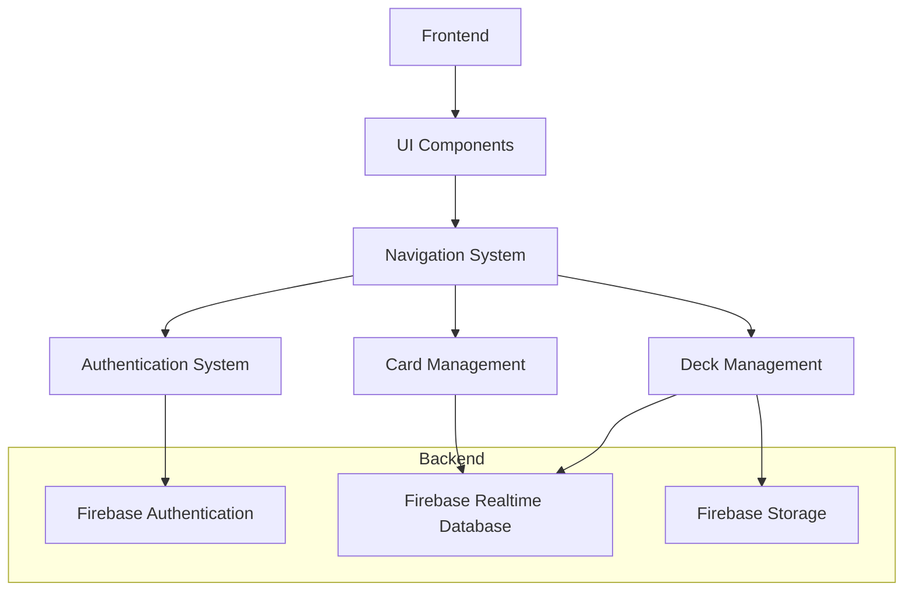
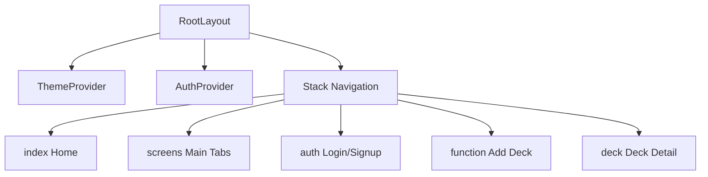
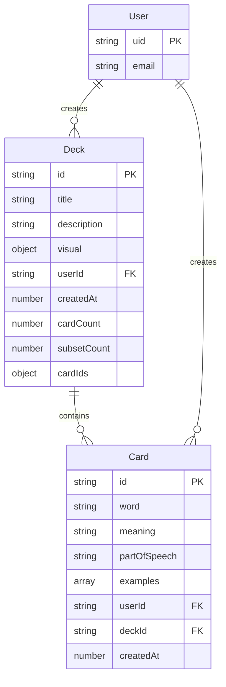
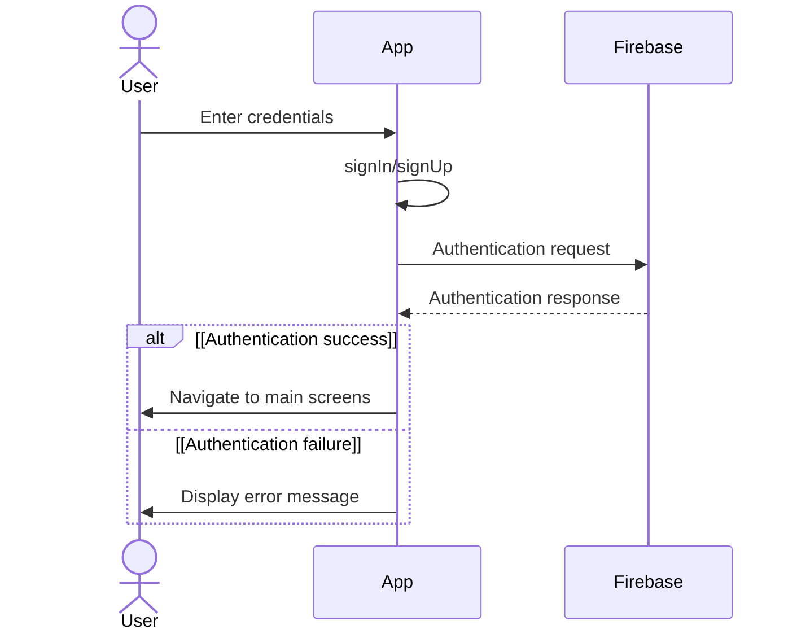
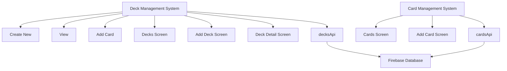
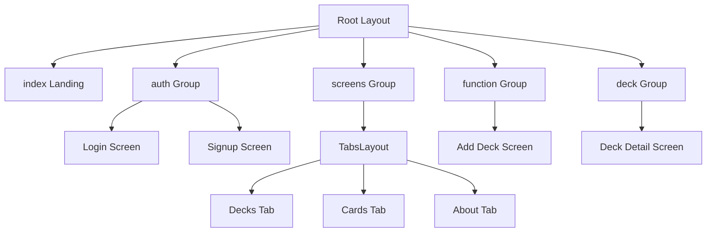
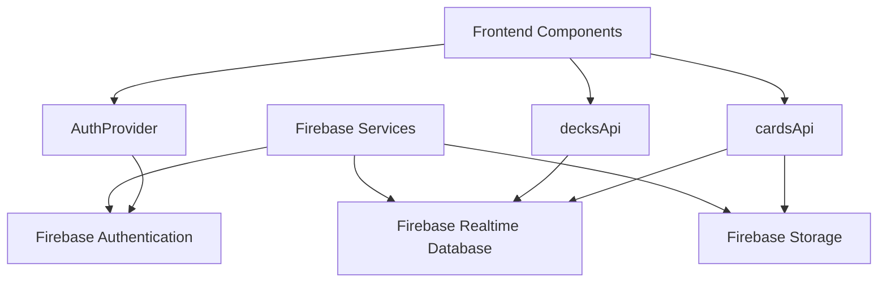

# Overview: Vocabulary Learning by FlashCard

## Relevant Source Files

- [.gitignore](https://github.com/Binh1012/Vocabulary-Learning-by-PlashCard/blob/6450efa8/.gitignore)
- [README.md](https://github.com/Binh1012/Vocabulary-Learning-by-PlashCard/blob/6450efa8/README.md)
- [app.json](https://github.com/Binh1012/Vocabulary-Learning-by-PlashCard/blob/6450efa8/app.json)
- [app/_layout.tsx](https://github.com/Binh1012/Vocabulary-Learning-by-PlashCard/blob/6450efa8/app/_layout.tsx)

## Purpose and Scope

This document provides a high-level overview of the **Vocabulary Learning by FlashCard** application, a React Native app built with Expo that helps users create and study vocabulary flashcards. This overview presents the system architecture, core data model, key features, and component relationships to help developers understand how the application is structured and functions.

For specific details about setting up the development environment, refer to [Project Setup and Configuration](#) and [Development Environment](#).

## System Architecture

The application follows a modern mobile app architecture with a React Native frontend and Firebase backend services.

**Sources**: [app/_layout.tsx:1-31](https://github.com/Binh1012/Vocabulary-Learning-by-PlashCard/blob/6450efa8/app/_layout.tsx#L1-L31)

### Frontend
- **Framework**: React Native with Expo.
- **Routing**: Expo Router for file-based navigation.
- **State Management**: Context API for authentication and theme management.
- **UI**: React Navigation with light/dark theme support.

### Backend
- **Authentication**: Firebase Authentication for user management.
- **Database**: Firebase Realtime Database for storing decks and cards.
- **Storage**: Firebase Storage for media (e.g., card visuals).

## Core Components

The application consists of the following core components:

1. **Authentication System**: Manages user signup, login, and session persistence.
2. **Deck Management**: Handles the creation, viewing, editing, and deletion of flashcard decks.
3. **Card Management**: Handles the creation, viewing, and management of individual flashcards within decks.
4. **Navigation System**: Uses Expo Router for file-based routing to navigate between different screens.

The root layout wraps the entire application in necessary providers:

**Sources**: 
- [app/_layout.tsx:8-31](https://github.com/Binh1012/Vocabulary-Learning-by-PlashCard/blob/6450efa8/app/_layout.tsx#L8-L31)
- [app.json:1-42](https://github.com/Binh1012/Vocabulary-Learning-by-PlashCard/blob/6450efa8/app.json#L1-L42)

## Data Model

The application is built around three primary entities: Users, Decks, and Cards.

This model represents the core functionality of the application, where:
- Users can create multiple decks for organizing their vocabulary.
- Decks contain metadata and references to cards.
- Cards contain the actual vocabulary words, meanings, and examples.

**Sources**: [app/_layout.tsx:6-7](https://github.com/Binh1012/Vocabulary-Learning-by-PlashCard/blob/6450efa8/app/_layout.tsx#L6-L7)

## Key Features

### Authentication Flow

The application implements a complete authentication system for user management:

**Sources**: 
- [app/_layout.tsx:6-7](https://github.com/Binh1012/Vocabulary-Learning-by-PlashCard/blob/6450efa8/app/_layout.tsx#L6-L7)
- [app/_layout.tsx:18-28](https://github.com/Binh1012/Vocabulary-Learning-by-PlashCard/blob/6450efa8/app/_layout.tsx#L18-L28)

### Deck and Card Management

The application revolves around managing decks and cards:

**Sources**: [app/_layout.tsx:22-24](https://github.com/Binh1012/Vocabulary-Learning-by-PlashCard/blob/6450efa8/app/_layout.tsx#L22-L24)

## Navigation Structure

The application uses Expo Router with file-based routing:

The navigation is configured in the root layout file, which sets up the Stack navigation and wraps the application in the required providers. The file-based routing structure corresponds to the directory structure in the `app` folder.

**Sources**: 
- [app/_layout.tsx:3-30](https://github.com/Binh1012/Vocabulary-Learning-by-PlashCard/blob/6450efa8/app/_layout.tsx#L3-L30)
- [app.json:26-27](https://github.com/Binh1012/Vocabulary-Learning-by-PlashCard/blob/6450efa8/app.json#L26-L27)

## Technology Stack

| Component          | Technology                                    |
|--------------------|-----------------------------------------------|
| Framework          | React Native with Expo                        |
| Routing            | Expo Router (file-based)                      |
| Backend            | Firebase (Authentication, Realtime Database, Storage) |
| UI Theme           | React Navigation themes with light/dark mode support |
| Fonts              | Custom fonts loaded via Expo Font             |

**Sources**: 
- [app.json:1-42](https://github.com/Binh1012/Vocabulary-Learning-by-PlashCard/blob/6450efa8/app.json#L1-L42)
- [app/_layout.tsx:1-5](https://github.com/Binh1012/Vocabulary-Learning-by-PlashCard/blob/6450efa8/app/_layout.tsx#L1-L5)
- [README.md:1-51](https://github.com/Binh1012/Vocabulary-Learning-by-PlashCard/blob/6450efa8/README.md#L1-L51)

## System Integration

The application integrates with Firebase services through dedicated API modules:

The application follows a clean architecture pattern where UI components interact with Firebase through dedicated API modules, maintaining separation of concerns and enabling easier testing and maintenance.

**Sources**: 
- [app/_layout.tsx:6-7](https://github.com/Binh1012/Vocabulary-Learning-by-PlashCard/blob/6450efa8/app/_layout.tsx#L6-L7)
- [app/_layout.tsx:18-28](https://github.com/Binh1012/Vocabulary-Learning-by-PlashCard/blob/6450efa8/app/_layout.tsx#L18-L28)

## Summary

The **Vocabulary Learning by FlashCard** application is a comprehensive React Native mobile app built with Expo that enables users to create and manage flashcards for vocabulary learning. It features a clean architecture with distinct systems for authentication, deck management, and card management, all integrated with Firebase backend services. The application uses modern development practices including file-based routing, context-based state management, and a responsive UI with light/dark theme support.

For more detailed information about specific aspects of the system, refer to:
- [Navigation and Routing](#)
- [Authentication System](#)
- [Deck Management](#)
- [Card Management](#)
- [Firebase Integration](#)
